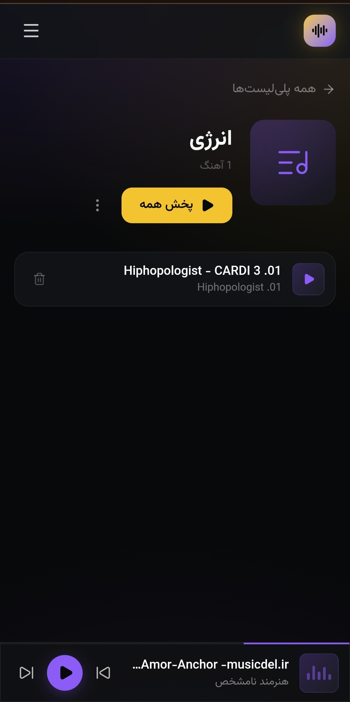

<div align="center">


<br/>


<br/>

### 🎧 A personal, offline-capable music player — installable straight from your browser, no app store required.

<br/>



<br/>
<br/>


</div>

---

<br/>

## ✨ Overview

**Musicar (موزیکار)** is a sleek, RTL-first personal music player built as a modern web app — and packaged as a fully installable **Progressive Web App (PWA)**. Add your tracks, organize them into playlists, and play everything even when you're completely offline.

No native build tools. No app store review. No 200MB download. Just open the link, tap **"Add to Home Screen,"** and you have a real app icon on your device.

<br/>

<div align="center">

```
  ╭──────────────────────────────────────────╮
  │   🎵  Add tracks   →   📂 Organize        │
  │   💾  Store locally →  📴  Play offline   │
  ╰──────────────────────────────────────────╯
```

</div>

<br/>

## 🚀 Features

<table>
<tr>
<td width="50%" valign="top">

### 🎨 Design
- Full **RTL** (Persian) interface, built correctly from the ground up
- Custom dark theme with vivid purple/blue accents
- Smooth, native-feeling transitions and gesture support
- Responsive — works equally well on mobile and desktop

</td>
<td width="50%" valign="top">

### ⚡ Core Functionality
- Create and manage **playlists**
- Persistent local library via **IndexedDB**
- Custom seek & volume sliders (properly RTL-aware!)
- Background playback with a persistent mini-player

</td>
</tr>
<tr>
<td width="50%" valign="top">

### 📴 Offline-First
- Installable **PWA** — real home-screen icon
- Service worker caches the entire app shell
- Downloaded tracks are stored **on-device**
- Zero network required after first load

</td>
<td width="50%" valign="top">

### 🛠️ Under the Hood
- **React 19** + **TypeScript** (strict mode)
- **Zustand** for state management
- **Dexie.js** wrapper over IndexedDB
- **Vite** build with `vite-plugin-pwa`

</td>
</tr>
</table>

<br/>

## 📱 Install It

<div align="center">

| Step | Action |
|:---:|:---|
| 1️⃣ | Open **[the live site](https://alirezadavari1.github.io/musicar/)** in Chrome (Android) or Safari (iOS) |
| 2️⃣ | Tap the **⋮ menu** → **"Add to Home Screen"** |
| 3️⃣ | Confirm — the Musicar icon appears on your home screen |
| 4️⃣ | Open it once online to cache everything |
| 5️⃣ | ✈️ Enable airplane mode — it still works! |

</div>

<br/>

## 🧩 Tech Stack

<div align="center">


</div>

<br/>

## 🏗️ Project Structure

```
musicar/
├── src/
│   ├── components/     # UI building blocks (PlayerBar, TrackList, ...)
│   ├── pages/           # Route-level views
│   ├── store/            # Zustand stores (playback, library, playlists)
│   ├── db/                # Dexie/IndexedDB schema
│   ├── hooks/              # Custom React hooks
│   ├── utils/                # Helpers
│   └── types/                 # Shared TypeScript types
├── public/
│   └── icons/                    # PWA app icons
├── vite.config.ts                 # Vite + PWA plugin config
└── index.html
```

<br/>

## 🖥️ Local Development

```bash
# Clone the repo
git clone https://github.com/alirezadavari1/musicar.git
cd musicar

# Install dependencies
npm install

# Start the dev server
npm run dev

# Build for production (outputs to /dist)
npm run build
```

<br/>

## 📦 Deployment

This project is deployed as a static site via **GitHub Pages**, served directly from the `dist/` build output. The PWA service worker (`vite-plugin-pwa`) precaches the entire app shell on first visit, enabling full offline functionality afterward.

<br/>

<div align="center">

### 🌟 If you like this project, consider giving it a star!


</div>
